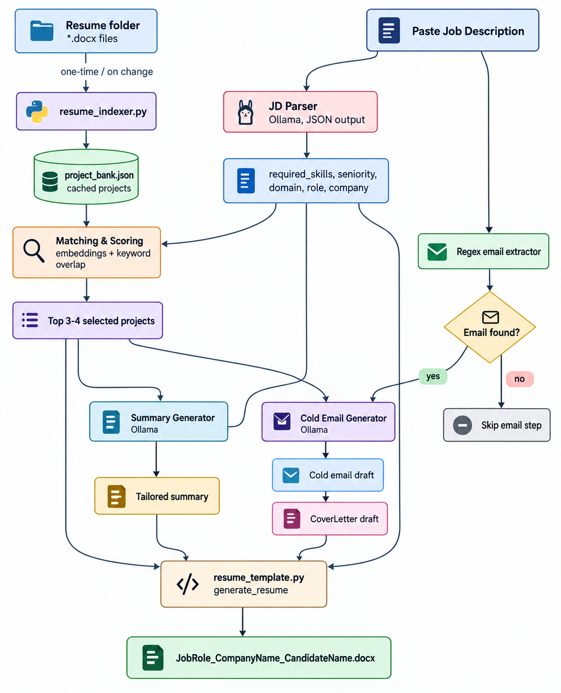
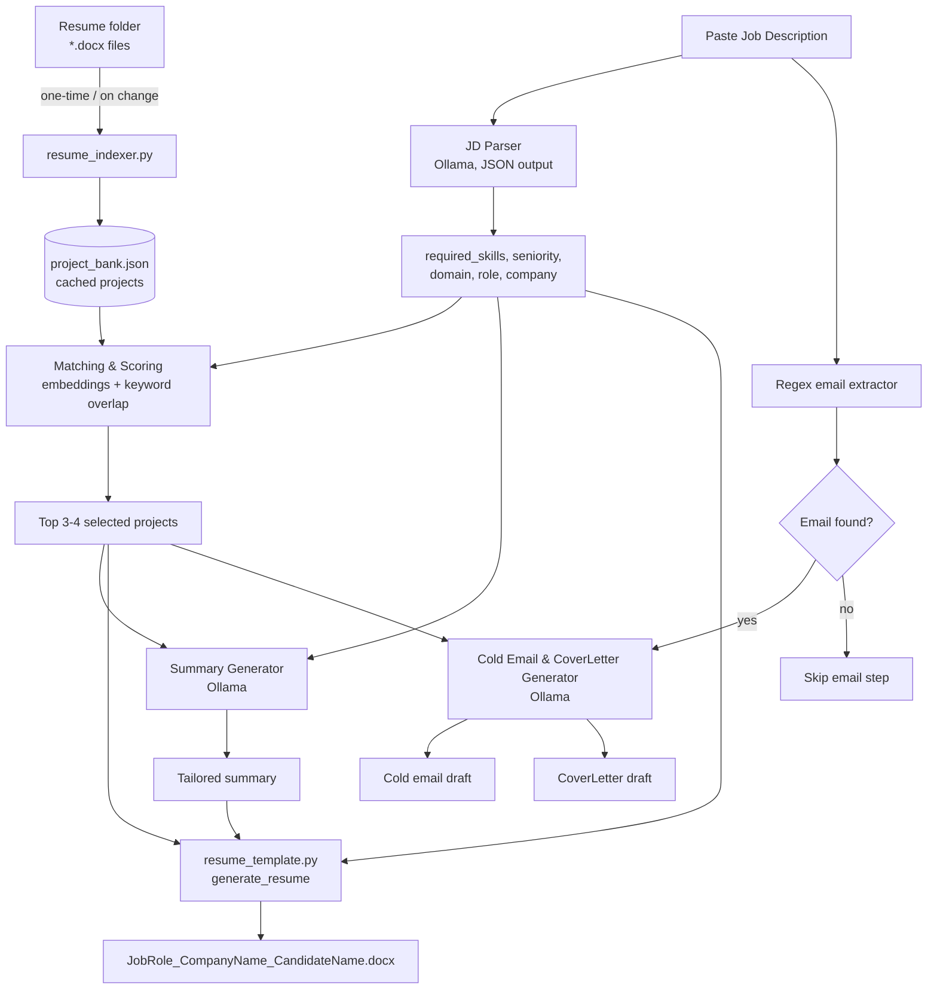

# JD-Tailored Resume Agent (Local Ollama)

Generate a resume tailored to a specific Job Description by automatically
selecting the most relevant projects from your own project bank, writing a
matching summary, and (optionally) drafting a cold email — all running
locally against Ollama, no cloud API keys required.

## Why this exists

Manually rewriting your resume for every job posting is slow, and it's easy
to bury the projects that actually match what a recruiter is looking for.
This project automates that: you keep a folder of past resumes, paste in a
JD, and the agent figures out which 3-4 projects best match, then produces
a ready-to-send `.docx`.

## How it works





**Key design choice:** the resume folder is only *indexed* when files
change — matching a new JD never re-parses raw `.docx` files, it queries
the cached `project_bank.json` instead. This keeps the agent fast and
avoids re-parsing fragile document formatting on every run.

## Project structure

```
.
├── README.md
├── requirements.txt
├── resume_template.py               # generate_resume(data) — reusable docx builder
├── resume_indexer.py                # scans resume folder, builds/updates project_bank.json
├── main.py                          # ties JD parsing + matching + generation + cold email together
├── candidate_profile.example.json   # copy to candidate_profile.json and fill in your details
├── candidate_profile.json           # your fixed resume info (git-ignore this — it's personal)
├── crawler_and_ranker.py.json           # extracts the core name of the project
├── project_bank.json                # generated cache (created after first index run)
└── resumes/                         # your folder of past tailored resumes (.docx)
```

## Prerequisites

- Python 3.9+
- [Ollama](https://ollama.com) installed and running locally
- An Ollama chat model pulled, e.g.:
  ```bash
  ollama pull llama3.1:8b 
  ```
  `Note:` You can pull and configure any different Ollama model (like llama3 or mistral) inside the .env file based on your machine's system configuration and available RAM. The application will run perfectly with any compatible model you choose

  
- An Ollama embedding model pulled, e.g.:
  ```bash
  ollama pull nomic-embed-text
  ```
- Python packages:
  ```bash
  pip install -r requirements.txt
  ```

## Setup

1. **Clone or copy this project** into a folder on your machine.
2. **Create a `resumes/` folder** and drop in your past resume `.docx`
   files (each one should contain a "Featured Projects" section with
   bold project titles, a `| Tech, Stack` line, and bullet points).
3. **Build the initial project index:**
   ```bash
   python resume_indexer.py ./resumes
   ```
   This creates `project_bank.json`. Re-run this command any time you add
   or edit a resume file — unchanged files are skipped automatically.

4. **Set up your candidate profile:**
   ```bash
   cp candidate_profile.example.json candidate_profile.json
   ```
   Edit `candidate_profile.json` with your real name, contact details,
   base skill list, work experience, and education. This is the part of
   your resume that stays fixed across every job application — only the
   summary and selected projects change per JD.

## Usage

```bash
python main.py
# Paste the job description, then press Ctrl+D (Linux/Mac) or Ctrl+Z + Enter (Windows)
```

Or read the JD from a file and choose an output folder:

```bash
python main.py --jd-file path/to/jd.txt --output-dir ./output
```

What happens:
1. The JD is sent to your local Ollama chat model, which extracts
   `job_role`, `company_name`, `required_skills`, `nice_to_have_skills`,
   `seniority`, and `domain` as structured JSON. A contact email (if any)
   is pulled out separately with a regex — no LLM needed for that part.
2. Every project in `project_bank.json` is embedded (once — embeddings
   are cached back into the file) and scored against the JD's required
   skills using a blend of embedding similarity and keyword overlap.
3. The top 3-4 projects are selected, with a diversity pass that swaps in
   a lower-ranked project if it covers a required skill nothing else does.
4. A tailored 3-4 sentence summary is generated from the JD and the
   selected projects.
5. The resume is assembled and saved as
   `JobRole_CompanyName_CandidateName.docx`.
6. If a contact email was found in the JD, a short cold email referencing
   1-2 of the strongest matching projects is generated and saved as
   `ColdEmail_JobRole_CompanyName.txt` alongside the resume.

### Optional: choosing different Ollama models

By default `main.py` uses `llama3.1:8b` for chat and `nomic-embed-text`
for embeddings. Override with environment variables if you're using
different local models:

```bash
export OLLAMA_CHAT_MODEL=qwen2.5:7b-instruct
export OLLAMA_EMBED_MODEL=nomic-embed-text
python main.py
```

## Customizing for your own resume format

If your resume files use different section headers or bullet styles than
the default template, adjust:
- `_looks_like_project_title()` and `_extract_projects_from_docx()` in
  `resume_indexer.py` — controls how projects are detected and parsed.
- The section names/order and styling constants (`PRIMARY_HEX`, fonts,
  spacing) at the top of `resume_template.py` — controls how the final
  document looks.

## Roadmap

- [x] Reusable `generate_resume(data)` template function
- [x] Folder indexer with change-based caching
- [x] JD parsing via Ollama (structured JSON output)
- [x] Embedding-based project matching + keyword scoring + diversity selection
- [x] Tailored summary generation
- [x] Cold email generation
- [x] CLI wrapper (`main.py`)

## Notes for other candidates using this

- This project doesn't fabricate experience — it only *selects and
  rephrases* projects you've actually done, based on which ones best
  match a given JD. Keep your `resumes/` folder honest; the output is
  only as good as the source material.
- Everything runs locally through Ollama — no resume data or JD text is
  sent to an external API.
